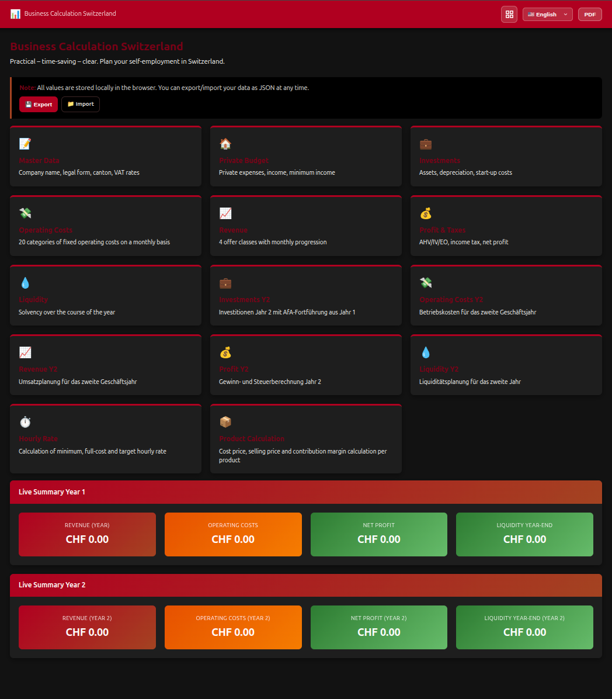

# 🇨🇭 Swiss Business Kalkulation

> **Praktisch – zeitsparend – übersichtlich.**  
> A browser-based business planning tool for self-employed individuals and startups in Switzerland.

[](https://opensource.org/licenses/MIT)
[]()
[]()

---

<p align="center">
   </img>
</p>

## 🌐 Languages / Sprachen / Langues / Lingue

The entire application supports **German, English, French and Italian** – including all labels, help texts, calculations and PDF exports.

| Language | Status |
|----------|--------|
| 🇩🇪 Deutsch | ✅ Complete |
| 🇺🇸 English | ✅ Complete |
| 🇫🇷 Français | ✅ Complete |
| 🇮🇹 Italiano | ✅ Complete |

---

## ✨ Features

### Year 1 – Foundation
- **📊 Dashboard** – Live overview of revenue, operating costs, net profit and year-end liquidity
- **🏢 Master Data** – Company details, legal form, canton, VAT rates
- **🏠 Private Budget** – Private expenses & income to calculate minimum required income
- **🖥️ Investments** – Depreciation (AfA) calculator for existing and planned assets, plus start-up costs
- **📋 Operating Costs** – 20 categories of fixed costs with automatic monthly distribution
- **💰 Revenue Planning** – Up to 4 offer classes with monthly sales curves, VAT and resource input
- **📈 Profit & Taxes** – AHV/IV/EO, simplified income tax, net profit calculation
- **💧 Liquidity** – Monthly cash-flow forecast with cumulative balance
- **⏱️ Hourly Rate** – Minimum, full-cost and target hourly rate incl. VAT
- **📦 Product Calculation** – Cost price, selling price and contribution margin per product

### Year 2 – Growth & Continuation
- **📊 Dashboard Year 2** – Live overview with Year 1 carry-forward (liquidity end-balance → start balance)
- **🖥️ Investments Year 2** – Four distinct blocks:
  - Existing investments (residual value from Year 1 with correct AfA carry-forward)
  - Year 1 planned investments (AfA continues into Year 2)
  - Year 2 new planned investments (gross)
  - One-time non-capitalized purchases (immediate expense)
- **📋 Operating Costs Year 2** – Independent 20-category cost planning for the second year
- **💰 Revenue Planning Year 2** – Separate offer classes and monthly sales curves
- **📈 Profit & Taxes Year 2** – Full P&L including non-capitalized purchases as operating expense
- **💧 Liquidity Year 2** – Cash-flow forecast with automatic Year 1 end-balance as starting point

### General
- **💾 Data Portability** – Export / Import your data as JSON
- **📄 PDF Export** – Generate printable PDFs of any page (via html2canvas + jsPDF)
- **🔒 Privacy First** – All data is stored **locally in your browser** (localStorage); no server, no tracking

---

## 🚀 Getting Started

No build step, no dependencies to install, no server required.

### Option 1: Open directly (file://)
1. Download or clone this repository
2. Open `index.html` in any modern browser (Chrome, Firefox, Edge, Safari)
3. Start planning

### Option 2: Local development server
```bash
git clone https://github.com/realraven/swiss-business-calc-mini.git
cd swiss-business-calc-mini
# Any static server works, e.g.:
npx serve .
# or
python3 -m http.server 8000
```

### Option 3: GitHub Pages
Enable GitHub Pages in your repository settings and point it to the root folder – the app will be live instantly.

---

## 📁 Project Structure

```
swiss-business-calc-mini/
├── index.html                  # Dashboard / Overview (Year 1 & Year 2 live summaries)
├── docs
│   └──screenshot.png
├── pages
│   ├── masterdata.html         # Company master data
│   ├── private.html            # Private budget & minimum income
│   ├── investments.html        # Investments & depreciation (AfA) Year 1
│   ├── investments_year2.html  # Investments Year 2 (4 blocks: existing Y1, AfA Y1→Y2, new Y2, non-capitalized)
│   ├── costs.html              # Operating costs (20 categories) Year 1
│   ├── costs_year2.html        # Operating costs Year 2
│   ├── revenue.html            # Revenue planning Year 1
│   ├── revenue_year2.html      # Revenue planning Year 2
│   ├── profit.html             # Profit & tax calculation Year 1
│   ├── profit_year2.html       # Profit & tax calculation Year 2
│   ├── liquidity.html          # Liquidity forecast Year 1
│   ├── liquidity_year2.html    # Liquidity forecast Year 2
│   ├── hourlyrate.html         # Hourly rate calculator
│   └── productcalc.html        # Product calculation
├── src
│   ├── css/
│   │   └── style.css           # Stylesheet
│   └── js/
│       ├── app.js              # Core business logic & calculations (Year 1 + Year 2)
│       └── i18n.js             # i18n: translations (DE/EN/FR/IT)
├── data.json                   # Default data template
├── .gitignore
└── README.md
```

### Architecture
- **Single-page feel, multi-page setup** – Each module is a separate HTML file for clean separation, sharing `i18n.js`, `app.js` and `style.css`
- **Modular i18n** – `i18n.js` is completely decoupled from business logic; `app.js` only calls `Lang.t(key)`
- **Zero backend** – 100% client-side; data persists via `localStorage`
- **Year 2 continuity** – Year 1 closing figures (liquidity end-balance, residual book values) automatically feed into Year 2 calculations

---

## 🛠️ Tech Stack

| Technology | Purpose |
|------------|---------|
| Vanilla HTML5 | Semantic markup |
| Vanilla CSS3 | Custom properties, Grid, Flexbox |
| Vanilla JavaScript (ES6+) | Business logic, DOM manipulation |
| localStorage | Persistent client-side data storage |
| html2canvas (CDN) | PDF page rendering |
| jsPDF (CDN) | PDF generation |

---

## 📖 Usage Tips

1. **Start with Master Data** – Enter your company details and check the VAT settings
2. **Fill Private Budget** – This determines your minimum required income, which flows into all other calculations
3. **Plan Investments Year 1** – Existing assets, planned purchases and one-time start-up costs
4. **Enter Operating Costs Year 1** – Add all monthly/quarterly/yearly fixed costs; the tool distributes them automatically
5. **Define Revenue Year 1** – Set up your offers, prices and expected monthly sales
6. **Check Profit Year 1** – See immediately if your plan works financially
7. **Monitor Liquidity Year 1** – Ensure you won't run out of cash in any month
8. **Calculate Hourly Rate** – Know exactly what you need to charge per hour
9. **Run Product Calculation** – Calculate cost prices, selling prices and contribution margins per product
10. **Plan Year 2** – Navigate to Year 2 modules:
    - **Investments Year 2** automatically carries forward Year 1 residual values and continues linear AfA. Add new Year 2 investments and one-time non-capitalized purchases separately.
    - **Liquidity Year 2** defaults the start balance to Year 1's year-end liquidity.
    - All other Year 2 modules work independently, allowing you to model growth or changed cost structures.

### Data Backup
Use the **Export** button on the dashboard to save your data as a JSON file. You can re-import it later or on another device.

---

## ⚠️ Disclaimer

**This tool is for planning and educational purposes only.**  
It does **not** constitute tax, legal or financial advice. Tax rates (especially income tax) vary by canton and municipality in Switzerland. Always consult a certified tax advisor (Steuerberater) or fiduciary before making business decisions.

*Die vorliegende Kalkulation ersetzt keine Steuerberatung.*  
*Ce calcul ne remplace pas un conseil fiscal.*  
*Questo calcolo non sostituisce una consulenza fiscale.*

---

## 🤝 Contributing

Contributions are welcome! Whether it's:
- Improving translations
- Adding new canton-specific tax rates
- UI/UX enhancements
- Bug fixes
- Extending to Year 3+ planning

Please open an issue or pull request.

### Translation Workflow
All text is centralized in `i18n.js`. To add a new language:
1. Add a new key (e.g. `es: { ... }`) following the existing structure
2. Translate all strings
3. Add the language button to the navbar in each HTML file
4. Done – no business logic needs to be touched

---

## 📄 License

This project is licensed under the **MIT License** – see the [LICENSE](LICENSE) file for details.

Third-party libraries used:
- [html2canvas](https://github.com/niklasvh/html2canvas) – MIT
- [jsPDF](https://github.com/parallax/jsPDF) – MIT

---

## 🙏 Acknowledgments

Built with ❤️ in Switzerland for Swiss founders, freelancers and small business owners.  
Special thanks to everyone who believes that financial planning tools should be **free, private and accessible**.

---

<div align="center">
  <strong>⭐ Star this repo if it helped you plan your business!</strong>
</div>
